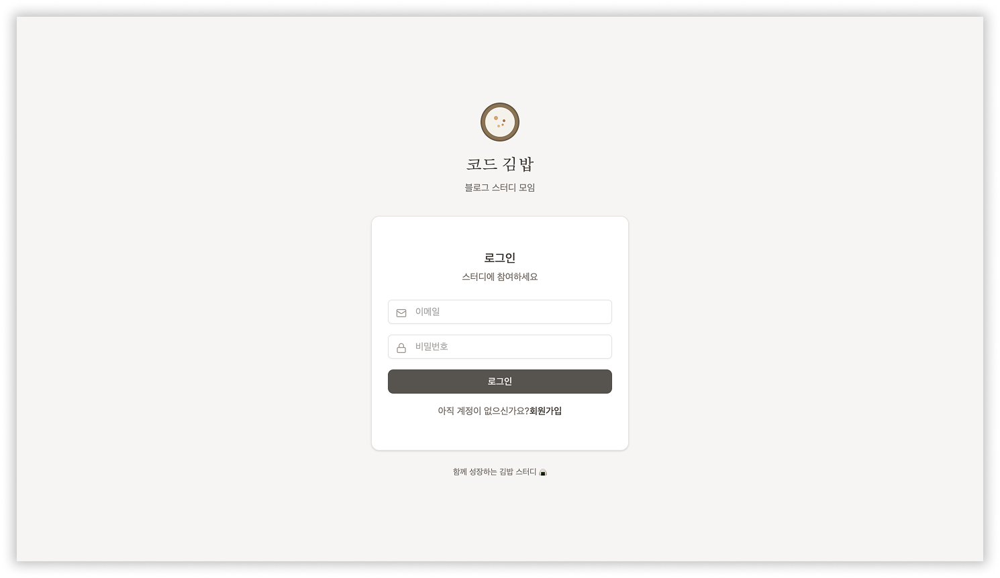
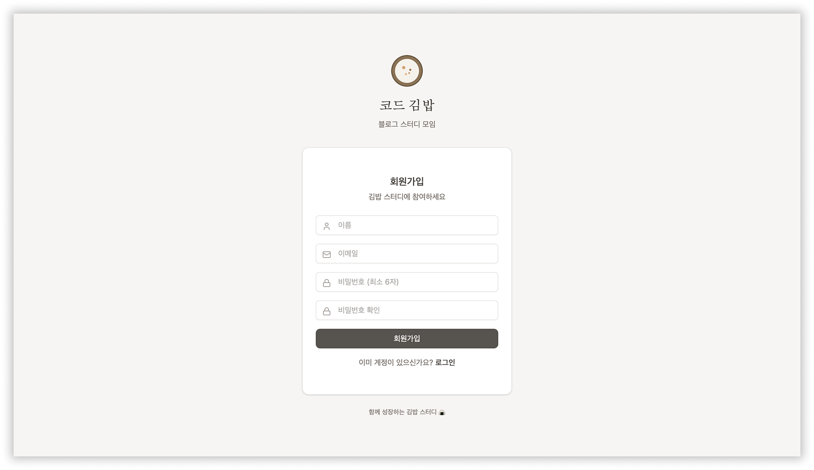
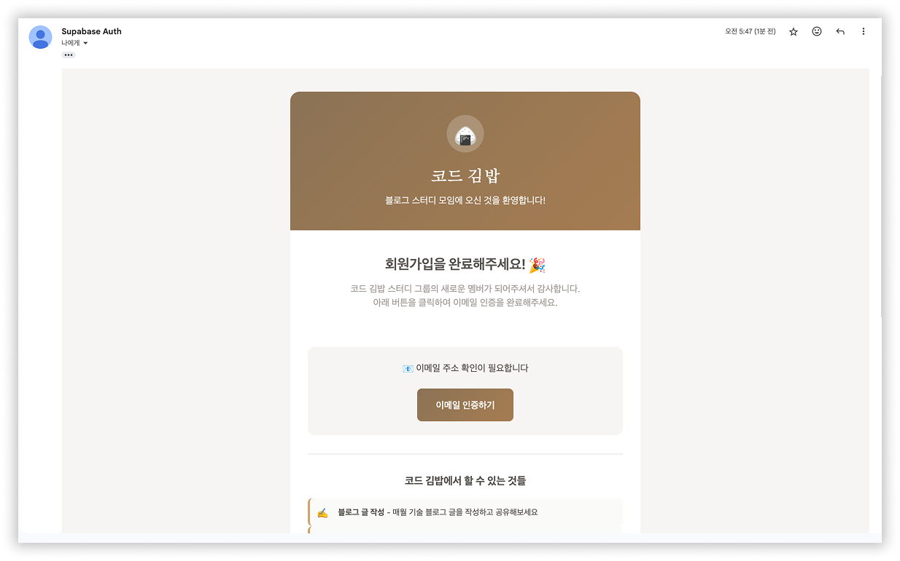
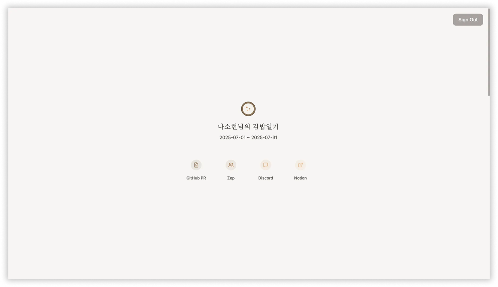
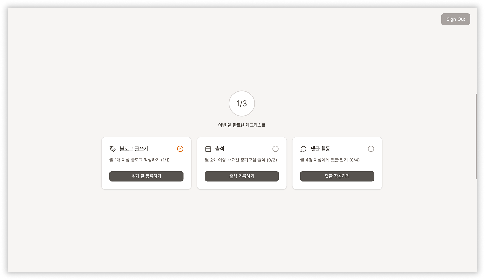
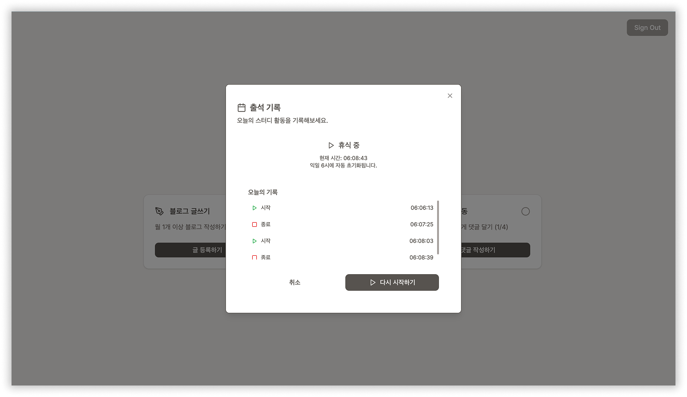
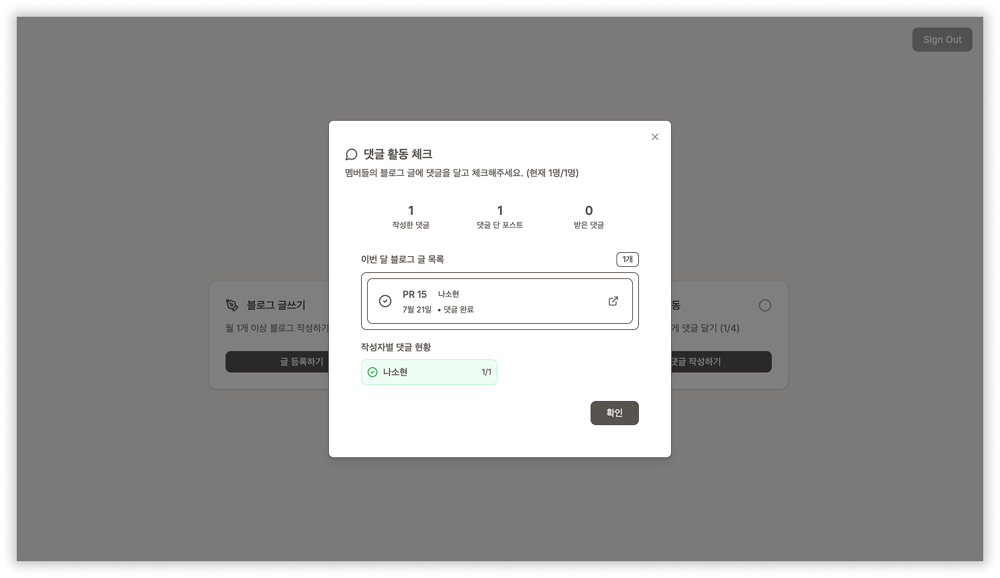

# 🍙 코드 김밥 (Code Kimbap)

블로그 스터디 모임을 위한 체크리스트 관리 웹 애플리케이션입니다.

코드 김밥 블로그 스터디 모임 멤버들의 월별 활동을 관리합니다.

\*매달 3가지 체크리스트를 완수하지 못하면 벌금을 냅니다.

## ✨ 메뉴얼

### 로그인

접속 초기화면입니다. 회원가입 후 로그인할 수 있습니다.



### 회원가입

폼을 완성하고 메일 인증을 시작합니다.



메일 인증을 하면 회원가입이 완료됩니다.



### 메인 화면

로그인 후 메인 화면입니다. 스터디 관련 외부 링크로 바로 갈 수 있습니다.



### 체크리스트 기능

블로그 제출뿐만 아니라, 출석 및 댓글을 확인합니다.







## 🛠 기술 스택

### Frontend

- **Next.js 14** (App Router)
- **TypeScript**
- **Tailwind CSS v4**
- **Lucide React** (아이콘)

### Backend

- **Supabase** (Database + Authentication)
- **PostgreSQL** (관계형 데이터베이스)
- **Row Level Security (RLS)**

### 배포

- **Vercel** (Frontend)
- **Supabase** (Backend)

## 🏗 프로젝트 구조

```
code-kimbap/
├── app/                    # Next.js App Router
│   ├── login/             # 로그인 페이지
│   ├── change-password/   # 비밀번호 변경
│   ├── page.tsx          # 홈페이지 (서버 컴포넌트)
│   └── layout.tsx        # 루트 레이아웃
├── components/            # React 컴포넌트
│   ├── GimbapIcon.tsx    # 김밥 아이콘
│   ├── LoginForm.tsx     # 로그인 폼
│   ├── ChangePasswordForm.tsx
│   └── HomeLayout.tsx    # 홈 레이아웃
├── types/                # TypeScript 타입 정의
├── utils/                # 유틸리티 함수
│   └── supabase.ts      # Supabase 클라이언트
├── middleware.ts         # 인증 미들웨어
└── README.md
```

## 🗄 데이터베이스 스키마

### 주요 테이블

- `users` - 사용자 정보
- `monthly_periods` - 월별 기간 관리
- `attendance_records` - 출석 기록
- `checklist_blog_posts` - 블로그 글 체크리스트
- `checklist_attendance` - 출석 체크리스트
- `checklist_comments` - 댓글 체크리스트
- `comment_checks` - 댓글 상호 체크
- `penalties` - 벌금 관리

### 통계 뷰

- `user_monthly_stats` - 월별 통계
- `user_weekday_stats` - 요일별 통계
- `monthly_checklist_status` - 체크리스트 현황

## 📈 향후 계획

- [ ] 관리자 허용 회원가입
- [ ] 벌금 시스템 연동
